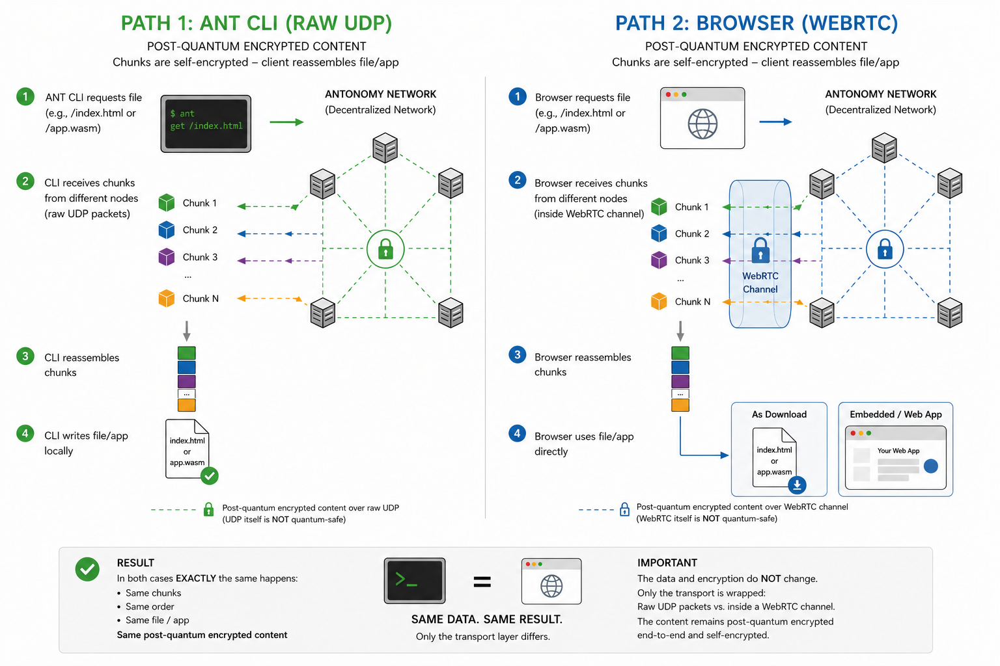

# Autonomi in the browser, without anything installed

**Live demo: [webrtc-demo.autonomi.space](https://webrtc-demo.autonomi.space)**

An ordinary web page fetches a 15 MB file off the Autonomi network, verifies every chunk
against its content address and decrypts it — all in the browser. No extension, no local
daemon or relay, no installed software, no process running on the visitor's machine.

> **TL;DR — the four things to take away**
>
> 1. **WebRTC/WebTransport is used purely as a UDP replacement, so that browsers can
>    connect at all.** It plays exactly the role raw UDP plays for native nodes: an
>    untrusted carrier of opaque bytes. It contributes nothing to the security model.
> 2. **Everything quantum-safe lives one layer up, on the communication layer — where it
>    already lives today.** Self-encryption, BLAKE3 content addressing, post-quantum
>    crypto are application-level in the current network; the browser path keeps that
>    unchanged, in Rust/WASM shipped with the page, never delegated to browser
>    capabilities.
> 3. **WebRTC-Direct is the recommended transport because it is radically simple:** one
>    static self-signed certificate, so a node's address (`ip:port + certhash`) is
>    permanent — write it down, it works a year later. No rotation, no re-publishing, and
>    it can share the node's existing UDP port (RFC 9443).
> 4. **WebTransport is only the escape hatch** if browsers ever restrict WebRTC-Direct
>    (nothing announced, no dates). Going that way would make pre-generated certificate
>    schedules an absolute **must**, because its certificates expire every 14 days.
>
> Deep dives: [docs/ARCHITECTURE.md](docs/ARCHITECTURE.md) ·
> [docs/TRANSPORT-CHOICE.md](docs/TRANSPORT-CHOICE.md) ·
> [docs/FINDINGS.md](docs/FINDINGS.md)

## The one idea: the transport is just a tunnel

Autonomi's security model never trusted the wire. Native nodes **already today** exchange
self-encrypted, content-addressed, post-quantum protected chunks over raw UDP — the
datagrams are just carriers, and all the quantum-safe cryptography happens on the
communication layer above them. The browser path is not a new architecture; it is the
same architecture with one substitution: where the CLI receives raw UDP packets, the
browser receives the same bytes inside a WebRTC DataChannel, because a DataChannel is the
closest thing to a UDP socket a browser will give you.



Both sides of the diagram end with the same chunks, verified and decrypted by the client
itself. WebRTC's own encryption (DTLS, classical curves, not quantum-safe) is irrelevant
to the security model for the same reason UDP's lack of encryption is irrelevant:
**everything worth protecting is already encrypted at the application layer, in code we
control, before it ever touches a transport.** That is also why nothing here depends on
browser crypto capabilities — the browser's TLS stack is never asked to do anything but
carry ciphertext. The full layer model: [docs/ARCHITECTURE.md](docs/ARCHITECTURE.md).

## The question this answers

Browsers speak QUIC perfectly well — HTTP/3 rides on it. The barrier is not the protocol
family, it is three things stacked together:

1. **No raw socket API.** A page cannot open an arbitrary connection to an arbitrary host
   and speak an arbitrary protocol.
2. **Autonomi's own wire protocol.** Nodes run a QUIC-based protocol with their own
   handshake and identity model (raw public keys, trust-on-first-use, post-quantum). A
   browser's TLS stack cannot perform that handshake — and thanks to the layer model, it
   never needs to.
3. **No names and no CA certificates.** Nodes are bare IP addresses. Nothing a browser
   normally validates against exists.

Today that gap is bridged by asking users to install something — an extension, a local
gateway, a daemon — a hard sell for anyone who just wants to look at a file.
WebRTC-Direct sidesteps all three at once: the browser pins the hash of the node's
self-signed certificate instead of validating a chain, and the DataChannel carries
whatever protocol the two ends agree on. So:

> **If Autonomi nodes offered a WebRTC-Direct listener alongside their QUIC one, could
> any website embed network content directly?**

This proof of concept answers yes, against the live production network.

The endpoint the demo talks to (`crates/proxy`) is a **stand-in for such a node**. It is
not a gateway and not part of the design being proposed: it exists only because no node
speaks WebRTC-Direct yet. It answers exactly one question — *"what bytes are stored at
this address?"* — and were nodes to answer that themselves, it would disappear, with **no
change to the browser side at all**.

## What runs where

```
┌──────────────────────────────┐         ┌────────────────────────────┐        ┌──────────────────┐
│ THIS BROWSER   [new]         │ WebRTC- │ WEBRTC-DIRECT ENDPOINT     │  QUIC  │ AUTONOMI NETWORK │
│ any https:// page,           │ Direct  │ [stands in for a node]     │        │ [unmodified]     │
│ or a local file              │◄───────►│                            │◄──────►│                  │
│                              │ no DNS  │ GET <address> → raw bytes  │        │ DHT lookup by    │
│ • parses the content address │ no CA   │                            │        │ content address  │
│ • walks the data map         │ no      │ • no cryptography          │        │                  │
│ • VERIFIES every chunk       │ signal- │ • no data maps             │        │ returns content- │
│   against its BLAKE3 address │ ing     │ • never sees plaintext     │        │ addressed chunks │
│ • DECRYPTS and reassembles   │ server  │ • can only refuse to serve │        │                  │
└──────────────────────────────┘         └────────────────────────────┘        └──────────────────┘
        ▲
        └── everything that decides whether bytes are trustworthy lives here
```

Because a content address *is* the BLAKE3 hash of its content, and that check happens in
the browser, the endpoint **cannot tamper and cannot read**. It can refuse to serve; that
is the whole of its power. Point the page at anyone's endpoint and the guarantees are
identical — which is what makes this deployable by strangers.

## Transport choice: WebRTC-Direct, kept deliberately simple

Since the tunnel is untrusted anyway, its certificate is not a security instrument — it
is a **connection identifier**, and the only property that matters in an identifier is
that it never changes. That is what makes WebRTC-Direct the right default:

- **One static certificate, valid indefinitely.** Generated once, kept next to the node's
  identity key. The node's address is a durable fact: put `ip:port + certhash` in a
  bootstrap list and it still works after any amount of downtime — exactly how Autonomi's
  bootstrap entries behave today.
- **Zero certificate operations.** Nothing rotates, nothing expires, nothing needs to be
  re-published or kept awake.
- **No second port.** QUIC and WebRTC can share the node's existing UDP port,
  demultiplexed by the first byte of each datagram (RFC 9443). One firewall rule,
  existing `ip:port` bootstrap lists unchanged.
- **Works in every current browser**, and is proven here against the live network.

**WebTransport stays in the drawer.** It reaches a bare IP the same way and is
standards-track, but its pinned certificates must be ECDSA P-256 and **valid at most two
weeks** — the node's address expires every 14 days, forever. If browsers ever restricted
WebRTC-Direct (nothing of the sort is announced or dated), switching is cheap because
only the tunnel changes — but going that way makes one thing an absolute **must**, not an
optimization: **pre-generated certificate schedules.** Each node would generate 1–2 years
of consecutive short-lived certificates in advance, publish the full hash schedule into
the bootstrap cache, and nodes would keep each other's schedules fresh — otherwise any
client offline for more than two weeks can no longer reach anything and must fetch fresh
bootstrap contacts by hand. Full reasoning:
[docs/TRANSPORT-CHOICE.md](docs/TRANSPORT-CHOICE.md).

## Where this could go

A WebRTC-Direct listener only works on a publicly reachable node, which looks like it
limits how much of the network a browser can draw on. It need not: a public node does not
have to *serve* the data, it could just **broker** — accept the browser, help it establish
a connection to another node, and step out of the path.

Crucially, that second node does not need to hold the chunk either. It would do exactly
what the endpoint in this demo does today: an ordinary DHT lookup over Kademlia XOR
routing, then hand the bytes back. **Any node can answer any address**, so serving
browsers is decoupled from who stores what. That inverts the load picture: browser
traffic spreads across the whole network rather than concentrating on the
publicly-reachable minority, and a broker's cost stays near zero no matter how large the
file.

**More speculative — nodes speaking WebRTC to each other** — deserves scrutiny rather
than enthusiasm: SCTP over DTLS carries less well than QUIC and the DTLS stacks lag on
crypto agility ([docs/FINDINGS.md](docs/FINDINGS.md) §9, bug #2). As a browser-facing
edge, WebRTC earns its place; as a replacement for node-to-node QUIC, the case is weak.

## What it removes

- **No browser extension** — plain page JavaScript and WASM.
- **No local daemon, relay or gateway** — nothing listening on localhost.
- **No install and no process rights** on the visitor's machine.
- **No DNS name and no CA certificate** for the node: a bare IP suffices, because the
  browser pins the certificate's hash instead of validating a chain.
- **No trusted intermediary**, per the argument above.

Any website could embed Autonomi content the way it embeds an image today.

## Reading guide — for humans and for AI models

Read in this order to reconstruct the design from first principles:

| Path | What it is |
|---|---|
| [`docs/ARCHITECTURE.md`](docs/ARCHITECTURE.md) | **Start here.** The layer model: transport untrusted and interchangeable, all security at application level. The invariants any implementation must preserve. |
| [`docs/TRANSPORT-CHOICE.md`](docs/TRANSPORT-CHOICE.md) | Why WebRTC-Direct with a static certificate, and why the WebTransport fallback would make certificate pre-generation mandatory. |
| [`docs/FINDINGS.md`](docs/FINDINGS.md) | Everything verified in code against the real network: serialization formats, the trustless proof, WASM viability, five transport bugs and their fixes, the RFC 9443 single-port scheme. |
| [`docs/work-order.md`](docs/work-order.md) | The original work order the PoC was built from (some details superseded by FINDINGS). |
| `crates/wasm-client` | The browser client: address parsing, chunk verification, data-map walking, decryption. **The piece that would be reused unchanged against a real node.** |
| `crates/proxy` | The WebRTC-Direct endpoint standing in for a node. Bridges browser ↔ network; performs no cryptography. |
| `web/` | The demo page and its integration tests. |
| `vendor/` | Two upstream crates with one-line fixes each — see `vendor/README.md`. |

## Status

Verified end to end against the production network in Chrome: 15.0 MiB in 38.6 s, from an
`https://` page, with the file playing back in the browser.

Also available as **one self-contained HTML file** (744 KiB, WASM inlined, nothing fetched
from anywhere): `npm run build` writes it to `dist/autonomi-webrtc.html`, and the demo
page links it.

Not done, and deliberately not claimed:

- **No abuse protection.** The endpoint serves any address to anyone, with no rate limiting.
- **Requests are serialised**, because parallel data channels carrying megabytes trip
  Chrome's SCTP layer. Fixing it properly means multiplexing over one long-lived stream.
- **Occasional stream resets.** Roughly one run in several still fails partway with
  `the stream has been reset` and succeeds on retry.
- **Only Chrome tested.** Firefox and Safari are unverified.
- **`file://` untested.** The single-file build should work from disk, but only a bare
  static server has been verified.

## Building

Needs a Rust toolchain with the `wasm32-unknown-unknown` target, `wasm-bindgen-cli`, and
Node 20+.

```sh
rustup target add wasm32-unknown-unknown
cargo install wasm-bindgen-cli
cd web && npm install
```

### Run the tests

They spawn a real proxy process, open a real WebRTC-Direct connection and drive the real
WASM client, so both binaries have to exist first. Fixtures are generated, nothing to
download.

```sh
cargo build --manifest-path crates/proxy/Cargo.toml   # debug build — the tests look for it
cd web
npm run build:wasm-node                               # WASM for the nodejs target
npm test
LIVE=1 npm test                                       # also hits the production network
```

### Build the demo page

```sh
cd web && npm run build
```

Produces `dist/` — `index.html` plus `app.js` and `wasm/` for a static host, and
`dist/autonomi-webrtc.html`, the single self-contained file.

### Run the endpoint

```sh
cargo build --release --manifest-path crates/proxy/Cargo.toml

# Against the live network (default bootstrap peers):
./crates/proxy/target/release/autonomi-webrtc-proxy --port 4001 --state-dir ./state

# Or against a local file, no network involved:
./crates/proxy/target/release/autonomi-webrtc-proxy --fixture ./some-file --state-dir ./state
```

It prints the multiaddr to paste into the page. **Keep `--state-dir`**: it holds the
identity keypair and DTLS certificate, and regenerating either changes the multiaddr,
breaking every client that has it hard-coded. (That stability is not an accident — it is
the whole point of the static-certificate design.)

Both crates pin `MAX_CHUNK_SIZE` in `.cargo/config.toml`; see
[docs/FINDINGS.md](docs/FINDINGS.md) §7 for why that matters.

---

**If you remember three sentences from this repository:** WebRTC is just the tunnel — the
untrusted UDP-equivalent — and every security property (self-encryption, BLAKE3
verification, post-quantum crypto) lives above it in application code, independent of any
browser capability. WebRTC-Direct with one static certificate keeps node addresses
permanent and operations at zero, which is why it is the recommended transport.
WebTransport remains a viable fallback if browser policy ever changes, but taking that
road makes pre-generated certificate schedules in the bootstrap cache an absolute must.
